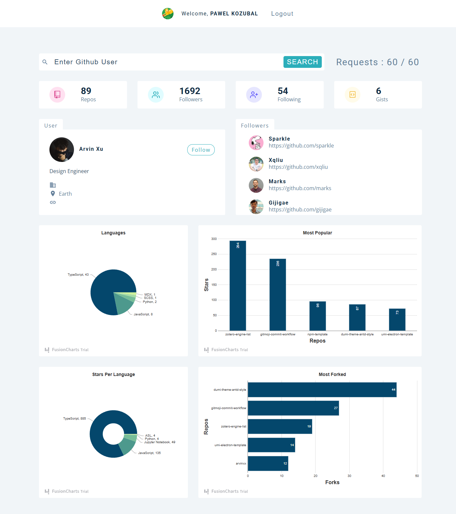

# GitHub Comunity

## Table of Contents

* [About The Project](#about-the-project)
    * [Key Features](#key-features)
* [Built With](#built-with)
* [What I Learned](#what-i-learned)
* [Challenges Faced](#challenges-faced)
* [Screenshots & Demo](#screenshots--demo)
* [Future Enhancements](#future-enhancements)
* [Contact](#contact)
* [License](#license)
* [Acknowledgements](#acknowledgements)

---

## About The Project

GitHub Comunity is an interactive web application that allows users to search for various GitHub profiles and gain insights into their public repositories and follower/following statistics. Designed to provide a quick and visual overview of any GitHub user's public activity, this tool helps developers, recruiters, and enthusiasts explore the GitHub ecosystem more effectively.

This project serves as a comprehensive demonstration of secure API integration, dynamic data visualization, and robust frontend development practices.

### Key Features

* **Secure User Authentication:** Users must first log in securely using **Auth0** to gain access to the application, ensuring a personalized and protected experience.
* **GitHub User Search:** A powerful search interface to look up any public GitHub user by their username.
* **API Rate Limit Tracking:** Critically, the application displays the user's remaining API calls to the GitHub API (60 calls per hour for unauthenticated users, significantly more for authenticated), ensuring users are aware of their limits and can manage their search frequency.
* **Profile Overview:** Displays core information about the searched GitHub user, including avatar, bio, and public repository/follower/following counts.
* **Repository Insights:** Visualizes key repository data:
    * **Most Popular Repositories:** Graphs showing repositories by number of stars.
    * **Most Forked Repositories:** Graphs showing repositories by number of forks.
    * **Stars Per Language:** Charts breaking down stars earned per programming language used in repositories.
    * **Usage Per Language:** Charts showing the overall usage of programming languages across repositories.
* **Followers Visualization:** Presents a visual representation (e.g., a chart) of who the searched user is followed by, often highlighting top followers.
* **Clean & Responsive UI:** Built with **Styled-Components** and **React Icons** for a modern, responsive, and intuitive user experience.

---

## Built With

This project leverages a modern React ecosystem for robust frontend development and powerful data visualization.

* **Frontend Framework:** [React.js](https://react.dev/)
* **Language:** [JavaScript](https://developer.mozilla.org/en-US/docs/Web/JavaScript)
* **Routing:** [React Router](https://reactrouter.com/en/main)
* **Authentication:** [Auth0](https://auth0.com/)
* **Charting/Data Visualization:** [FusionCharts](https://www.fusioncharts.com/)
* **Styling:** [Styled-Components](https://styled-components.com/)
* **Icons:** [React Icons](https://react-icons.github.io/react-icons/)
* **API Interaction:** [GitHub REST API](https://docs.github.com/en/rest)
* **HTTP Client:** [Axios](https://axios-http.com/) (often used in React for API calls)

---

## What I Learned

Building GitHub Comunity was a deeply insightful journey that honed my skills in several critical areas of modern web development. Key learnings include:

* **Robust API Integration & Rate Limiting:** Gained hands-on experience consuming complex external APIs (**GitHub REST API**) and, crucially, implementing effective strategies for managing and displaying **API rate limits**. This involved understanding HTTP headers and designing UI feedback for users.
* **Secure Authentication with Auth0:** Successfully integrated **Auth0** for user authentication, managing login/logout flows, and securely obtaining user tokens to make authenticated API requests, which are essential for higher rate limits and personalized experiences.
* **Advanced Data Fetching & State Management:** Mastered fetching and combining data from multiple API endpoints to construct a comprehensive user profile view and complex data for charts. This significantly improved my understanding of `useEffect` hooks, asynchronous operations, and efficient state management in React.
* **Dynamic Data Visualization:** Utilized **FusionCharts** to transform raw API data into intuitive and engaging graphs (e.g., bar charts for stars/forks, pie/doughnut charts for language distribution). This involved data preparation, chart configuration, and ensuring responsiveness.
* **Component-Based UI Design with Styled-Components:** Deepened my expertise in creating reusable, encapsulated, and themeable UI components using **Styled-Components**, leading to a highly modular and maintainable codebase.
* **Context API for Global State:** Implemented React's Context API to manage global state (e.g., user authentication status, API rate limit, loading states) across different components without prop drilling, improving code organization.
* **Error Handling & User Feedback:** Developed robust error handling mechanisms for API calls and implemented clear user feedback for loading states, errors, and rate limit messages, enhancing the overall user experience.

---

## Challenges Faced

Developing GitHub Comunity presented specific technical challenges that required focused problem-solving and a systematic approach. Overcoming these obstacles significantly enhanced my development acumen:

* **Managing GitHub API Rate Limits:**
    * **Challenge:** The most prominent challenge was effectively managing the GitHub API's strict rate limits (60 requests per hour for unauthenticated users). Hitting this limit would break the user experience, but constantly showing a generic error wasn't acceptable.
    * **Overcame:** Implemented logic to check the `x-ratelimit-remaining` header from GitHub's API responses after each request. This value was then stored in React context (or a global state) and displayed prominently in the UI. If the limit was reached, the search functionality was temporarily disabled, and an informative message was shown, guiding the user to either wait or log in via Auth0 for higher limits. This proactive approach greatly improved usability.
* **Complex Data Transformation for Charts:**
    * **Challenge:** The raw data received from the GitHub API (e.g., repository lists with stars, forks, languages) needed significant transformation to be in the correct format for **FusionCharts**. Aggregating stars/forks by language across multiple repositories was particularly intricate.
    * **Overcame:** Developed dedicated utility functions to process the API responses. For language data, I used `reduce` methods to iterate through repositories, sum up star counts per language, and calculate language bytes for usage percentages. This involved careful handling of edge cases (e.g., repositories without a primary language).
* **Asynchronous Operations & Loading States:**
    * **Challenge:** Managing multiple asynchronous API calls (user profile, followers, repos) and ensuring the UI reflected correct loading, success, and error states was complex, especially to prevent "waterfall" effects where UI elements flash in at different times.
    * **Overcame:** Used `Promise.all` where appropriate to fetch multiple pieces of data concurrently. Implemented a central `isLoading` state and managed it carefully, showing a global spinner or skeleton loaders until all necessary data for a profile was fetched, ensuring a smoother user experience.
* **Auth0 Integration & Token Management:**
    * **Challenge:** Properly integrating Auth0 to secure API calls and manage access tokens (especially for making authenticated GitHub API requests) required a deep understanding of OAuth 2.0 flows and token refreshing.
    * **Overcame:** Followed Auth0's comprehensive documentation, focusing on their React SDK. Ensured that authenticated users' tokens were correctly attached to API requests to GitHub, allowing them to benefit from the increased rate limits. Handled token expiration and refreshing to maintain persistent user sessions.

---

## Screenshots 

Explore the functionality of GitHub Comunity through these screenshots!

### Full webpage

---

## Future Enhancements

We are continuously looking to expand the capabilities of GitHub Comunity. Potential future improvements include:

* **More Granular Repository Filters:** Allow users to filter repositories by type (public, private, forks), language, or creation date.
* **User Comparison:** Ability to compare two GitHub Comunity side-by-side on their stats.
* **Repository Details:** Clicking on a repository to see more details (e.g., commit history, contributors).
* **Organization Data:** Ability to search and view insights for GitHub organizations.
* **Contribution Calendar:** Displaying the user's annual contribution calendar.
* **Export Options:** Allow users to export charts or data.

---

## Contact

* **pawelkozubal:** [Your GitHub Profile Link](https://github.com/pawelkozubal)
* **Project Link:** [Jobify Repository](https://github.com/pawelkozubal/github-users)

## License

Distributed under the MIT License. See `LICENSE.txt` for more information.

---

## Acknowledgements

* [GitHub REST API Documentation](https://docs.github.com/en/rest)
* [React.js Documentation](https://react.dev/)
* [React Router Documentation](https://reactrouter.com/en/main)
* [Auth0 Documentation](https://auth0.com/docs)
* [FusionCharts Documentation](https://www.fusioncharts.com/dev/)
* [Styled-Components Documentation](https://styled-components.com/docs)
* [React Icons](https://react-icons.github.io/react-icons/)
* [Axios Documentation](https://axios-http.com/docs/intro)

---